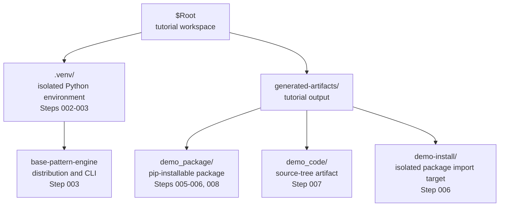
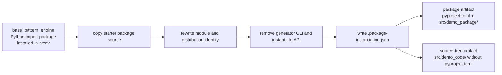

# Happy Path Tutorial

Base Pattern Engine creates independent generated artifacts from an installed starter package: a pip-installable `package` artifact or a source-only `source-tree` artifact. A generated artifact has its own package identity, no runtime dependency on `base-pattern-engine`, and can be extended and licensed separately.

This tutorial walks through the canonical happy path without cloning this repository. You will install `base-pattern-engine` directly from the public Git repository, generate a `package` artifact, verify that it imports independently, and generate a `source-tree` artifact.

All copyable commands in this tutorial are written for Windows PowerShell. That is the currently tested command path. Because the workflow is based on Python packaging, pip, Git, and generated Python modules, the same ideas should work on Linux and macOS with corresponding Bash-like commands. Linux and macOS command blocks should be added after they have been tested in a Unix-like environment.

## TL;DR

Install `base-pattern-engine` into a virtual environment from a Git ref, then run `base-pattern-engine instantiate` to create one of two generated artifacts:

- `demo_package/`: a `package` artifact, which is a generated pip-installable package with `pyproject.toml`.
- `demo_code/`: a `source-tree` artifact that can be copied into another project or imported through `PYTHONPATH`.

You do not need to clone the Base Pattern Engine repository. Git is only needed because pip uses it to fetch the `git+https` install URL.

## Terminology Used Here

- **Base Pattern Engine** is the human-readable project name.
- `base-pattern-engine` is the installed distribution name and CLI command.
- `base_pattern_engine` is the Python import package name for the engine API.
- A **generated artifact** is any output created by `base-pattern-engine instantiate`.
- A **`package` artifact** is a generated, pip-installable package with `pyproject.toml`.
- A **`source-tree` artifact** is generated source-only output without packaging metadata.

After those terms are introduced, "the engine" only refers to the installed generator.

## Why Use Base Pattern Engine

Use Base Pattern Engine when you want to:

- Start a new Python package or source tree from a repeatable baseline.
- Generate code that does not depend on the package that generated it.
- Keep generated outputs independent so they can be modified, distributed, and licensed separately.
- Re-run generation later with `--overwrite` while preserving conservative marker-based overwrite safety.
- Choose between a pip-installable `package` artifact and a source-only `source-tree` artifact.

## What You Will Build

By the end, you will have:

- Confirmed Python and Git are available.
- Created an isolated Python virtual environment.
- Installed `base-pattern-engine` directly from the Git repository.
- Generated a `package` artifact.
- Imported the generated package independently.
- Generated a `source-tree` artifact.
- Re-instantiated an existing generated artifact with `--overwrite`.

The example uses generic package names and a local tutorial directory. Replace the names and paths with your own project values when you use the workflow for real work.

## Prerequisites

This tutorial assumes Python 3.9 or newer and Git are already available on your `PATH`. Git does not need to be installed system-wide or with administrator privileges; it only needs to be callable by the shell that runs pip. You need PowerShell and a directory where you can create temporary tutorial files. You do not need to clone this repository.

## Visual Map

This diagram shows the local folders and artifacts created by the tutorial.



This diagram shows what `base-pattern-engine` does when it instantiates a generated artifact.



## 001. Verify Python And Git Are Available

Base Pattern Engine needs a Python interpreter so it can create a virtual environment, run pip, and execute generated Python artifacts. The virtual environment in step 002 is still the recommended place to install `base-pattern-engine`; avoid installing project packages into your system Python.

Git is needed because the install command uses a `git+https` URL. Even though pip runs inside the virtual environment, it still calls the external `git` executable from `PATH` to fetch the repository into a temporary build location before installing the package. That Git install can be user-level, system-level, or portable, as long as this shell can run `git --version`. You do not need to clone the repository yourself. If a future release is installed from a wheel, source archive, or package index instead of a Git URL, Git is not needed for that install path.

Verify Python and Git are available:

```powershell
python --version
python -m pip --version
git --version
```

If your machine uses `py`, `python3`, or a fully qualified interpreter path instead of `python`, use that command consistently when creating the virtual environment in step 002.

## 002. Create A Tutorial Workspace And Virtual Environment

Start outside any existing project. Set one root variable for the tutorial workspace so later commands can refer to the same location.

```powershell
$Root = "C:\work\base-pattern-engine-tutorial"
$Root = (New-Item -ItemType Directory -Force $Root).FullName
Set-Location $Root
```

Create and activate a virtual environment. `$Python` points directly at the virtual environment interpreter so install commands target `.venv` even if shell activation is unclear.

```powershell
python -m venv .venv
$Python = Join-Path $Root ".venv\Scripts\python.exe"
Set-ExecutionPolicy -Scope Process -ExecutionPolicy RemoteSigned
.\.venv\Scripts\Activate.ps1
& $Python -m pip install --upgrade pip
```

## 003. Install Base Pattern Engine From Git

Install `base-pattern-engine` directly from the public repository into the virtual environment.

```powershell
$BaseEngineRef = "main"
& $Python -m pip install "git+https://github.com/georgeAccnt-GH/base-pattern-engine.git@$BaseEngineRef"
```

For reproducible project work, replace `main` with a pinned tag or commit SHA.

Confirm the CLI is available from the active environment:

```powershell
base-pattern-engine --help
```

## 004. Choose A Generated Output Location

Create a directory for tutorial output:

```powershell
$GeneratedRoot = Join-Path $Root "generated-artifacts"
New-Item -ItemType Directory -Force -Path $GeneratedRoot
```

This keeps generated code separate from the virtual environment and any other project.

## 005. Generate A Package Artifact

Run the CLI:

```powershell
base-pattern-engine instantiate `
  --name demo_package `
  --output-path $GeneratedRoot `
  --license MIT `
  --owner-name "Package contributors"
```

Expected output resembles this, with the full path resolved from `$GeneratedRoot`:

```text
Created <resolved $GeneratedRoot>\demo_package
```

The generated `package` artifact folder should contain:

```text
demo_package/
  pyproject.toml
  LICENSE
  README.md
  .package-instantiation.json
  src/demo_package/
```

The `package` artifact is independent. It does not include the `base-pattern-engine` CLI, `instantiate()` API, `engine.py`, `cli.py`, or `_self` template bundle.

## 006. Inspect The Generated Package Identity

The generated package exposes explicit module and distribution identity values. This distinction matters most for a pip-installable `package` artifact: packaging metadata and pip use the distribution name, while Python imports use the module name.

`base-pattern-engine` normalizes `--name` into a module name by lowercasing it and replacing hyphens with underscores, then derives the distribution name by replacing underscores with hyphens. In this tutorial, `--name demo_package` creates module name `demo_package` and distribution name `demo-package`. If you passed `--name demo-package`, the generated names would still normalize to module `demo_package` and distribution `demo-package`.

Install the generated package into an isolated target directory:

```powershell
$PackagePath = Join-Path $GeneratedRoot "demo_package"
$InstallPath = Join-Path $GeneratedRoot "demo-install"
& $Python -m pip install --disable-pip-version-check --no-deps --target $InstallPath $PackagePath
```

Import the generated package from that target directory without loading the active environment's site packages:

```powershell
$env:PYTHONPATH = $InstallPath
& $Python -S -c "from demo_package import DISTRIBUTION_NAME, MODULE_NAME, print_package_identity; print(MODULE_NAME); print(DISTRIBUTION_NAME); print_package_identity()"
Remove-Item Env:\PYTHONPATH
```

Expected output:

```text
demo_package
demo-package
module: demo_package
distribution: demo-package
```

That confirms the generated runtime identity was rewritten from `base_pattern_engine` / `base-pattern-engine` to `demo_package` / `demo-package`.

## 007. Generate Source-Tree Output

Use `source-tree` when you want ordinary source code that can be copied into another project or imported by placing its `src` directory on `PYTHONPATH`.

```powershell
base-pattern-engine instantiate `
  --name demo_code `
  --artifact-kind source-tree `
  --output-path $GeneratedRoot `
  --license NONE
```

Expected output resembles this, with the full path resolved from `$GeneratedRoot`:

```text
Created <resolved $GeneratedRoot>\demo_code
```

The `source-tree` artifact should contain:

```text
demo_code/
  README.md
  .package-instantiation.json
  src/demo_code/
```

It intentionally omits `pyproject.toml`, package metadata, console scripts, dependency metadata, and build configuration.

To import it without installing it, set `PYTHONPATH` to the generated `src` directory:

```powershell
$env:PYTHONPATH = Join-Path $GeneratedRoot "demo_code\src"
& $Python -S -c "from demo_code import print_package_identity; print_package_identity()"
Remove-Item Env:\PYTHONPATH
```

Expected output:

```text
module: demo_code
distribution: demo-code
```

## 008. Re-Instantiate With Overwrite

When you upgrade `base-pattern-engine` and want to refresh a generated artifact, re-run the same command with `--overwrite`:

```powershell
base-pattern-engine instantiate `
  --name demo_package `
  --output-path $GeneratedRoot `
  --license MIT `
  --owner-name "Package contributors" `
  --overwrite
```

Overwrite is intentionally conservative. `base-pattern-engine` only replaces a directory that contains a matching `.package-instantiation.json` marker created by a previous instantiation. Do not create or edit that marker manually.

## 009. Clean Up Tutorial Artifacts

Deactivate the virtual environment if it is active:

```powershell
deactivate
```

Then remove the tutorial workspace if you no longer need it:

```powershell
Set-Location (Split-Path $Root -Parent)
Remove-Item -Recurse -Force $Root
```

## Happy Path Checklist

A successful run should leave you with these takeaways:

- You do not need to clone this repository to use `base-pattern-engine`.
- PowerShell is the tested command environment for this tutorial; the Python packaging workflow should translate to Unix-like shells with equivalent commands.
- `python -m venv .venv` creates an isolated environment for the tutorial.
- `& $Python -m pip install "git+https://github.com/georgeAccnt-GH/base-pattern-engine.git@<ref>"` installs `base-pattern-engine` from Git into the virtual environment.
- `base-pattern-engine instantiate` creates a generated artifact under `<output-path>/<module_name>`.
- `package` artifacts are pip-installable and include `pyproject.toml`.
- `source-tree` artifacts are importable source layouts and omit package build metadata.
- Generated artifacts expose `MODULE_NAME`, `DISTRIBUTION_NAME`, and `print_package_identity()`.
- Generated artifacts do not retain the `base-pattern-engine` generation interface.
- `--overwrite` is only for replacing a previously generated artifact with a valid matching marker.

## Notes For Real Projects

For reproducible real usage, install `base-pattern-engine` from a pinned Git tag or commit SHA instead of a moving branch. Choose the generated artifact license deliberately, and keep generated output in a directory you control. `base-pattern-engine` is designed for trusted local development workflows, not for processing untrusted or concurrently modified filesystem trees.
